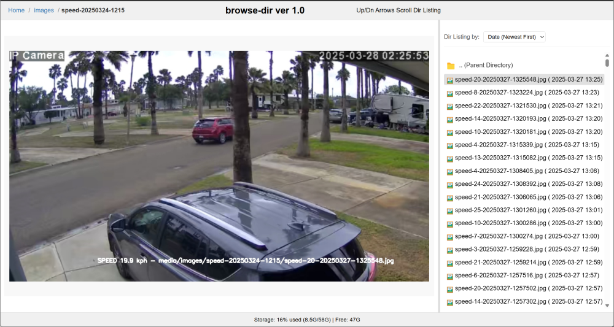

# browse-dir.py a Flask Media Directory Browser 

### Introduction

This is a python3 flask application that allows browsing media files in a web frame.
A directory listing of files/folders is displayed in the Right Frame.
File content eg images are displayed in the left frame.  Use up/down arrows or mouse to scroll the listing.
Content will automatically be displayed in the Left Frame
A folder breadcrumb in the top left corner allows easily moving to any previous folder.
The frame divider can be repositioned usinf the mouse <-->. The position will be saved between folders and run sessions.
Use the Right Frame pull down to change the listing sort.  This will also be saved between folders

I developed this using DeepSeek AI, as an optional replacement for my https://github.com/pageauc/speed-camera and https://github.com/pageauc/pi-timolo2 projects

### Installation

This was developed for a Raspberry Pi but should run on other platforms. You should not need to install any dependencies since flask is
already installed on Bullseye and Bookworm.

Open a terminal or SSH session and clone the github repository.

    cd ~
    git clone https://github.com/pageauc/browse-dir.git
    cd browse-dir
    chmod +x browse-dir.py
	
Edit the config.py settings	
	
	nano config.py
	
Edit the WEB_SERVER_PORT, WEB_SERVER_ROOT, WEB_PAGE_TITLE as required.
The WEB_SERVER_ROOT can be a relative or absolute path to the location of the media.
To exit and save nano changes Press Ctrl-x y  

To launch the web server

    ./browse-dir.py
	
From a browser on your local network paste the flask url eg

    http://192.168.1.178:5010
	

	
	

### Credits

Claude Pageau developed this application almost completely using DeepSeek AI over approx three chat sessions.  
I called my assistant Codey. It was a rewarding and at times frustrating experiance.

   